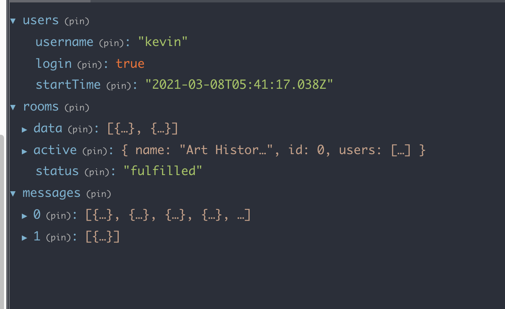

# Chatting App - Kevin
A chatting app that supposes multiple channel chatting

## What is this app about?
A chatting app that take in a username to allow someone to "login", and then see a list of chatting rooms with available messages. When you click into a room, you can view past messages, as well as add new messages.

- supports communicating with more than 2 users in ultiple different tabs

## Getting Started

- To install dependencies run `npm i`
- To run the web app and api server together, run `npm run dev`
- To run the web app separately, run `npm run start`
- To run api server separately, (in another terminal) run `npm run server`
- has no problem using node v14.15.3 (npm v6.14.9)

## Mock API

- Run the disney-server by running `npm run server`
- The server should be running on `http://localhost:8080/api`
- Navigating to `http://localhost:8080/api/rooms` should return rooms in json format.

# Features
1) Use Redux for managing global state. This app is using Redux Dev Tools, too. 
2) This app supports multiple browsers chatting and it caches data into memory so other users can see the chatting history when they login
3) Implemented web socket to communicate with the front end
4) Add deep linking support by using React Router.
5) whenever there is a new user login and send a message, the user would also notify other users on the application header.

# Todos:

1) write more unit tests
2) design ADA compliance flow
3) work on mobile to desktop responsiveness

### redux store shape

